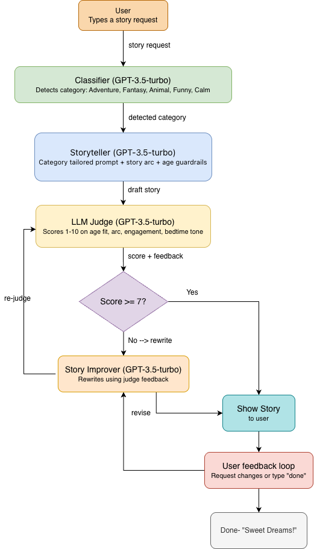

# 🌙 Bedtime Story Generator

An AI-powered bedtime story generator for children aged 5–10, built with GPT-3.5-turbo and Streamlit. The system uses a multi-agent approach with a storyteller, an LLM judge, and an improver to ensure every story is age-appropriate, engaging, and ends peacefully.

---

## System Architecture

The system uses four AI agents working together:

1. **Classifier** — detects the story category (Adventure, Fantasy, Animal, Funny, Calm) from the user's request
2. **Storyteller** — generates a story using a category-tailored prompt with role, story arc, and age guardrails
3. **LLM Judge** — scores the story 1–10 on age appropriateness, story arc, engagement, and bedtime suitability
4. **Story Improver** — rewrites the story using judge feedback if the score is below 7



---

## Features

- 🎨 **Clean web UI** built with Streamlit — no terminal needed
- 🏷️ **Smart categorization** — classifies requests into Adventure, Fantasy, Animal, Funny, or Calm and tailors the story prompt accordingly
- ⚖️ **LLM judge** scores every story on 4 criteria
- 🔄 **Auto-improvement** — stories scoring below 7 are automatically rewritten
- 📖 **Before/After toggle** — compare original and updated stories side by side
- 💬 **User feedback loop** — request changes and refine the story interactively
- 🌙 **Sweet dreams ending** with celebratory balloons

---

## Prompting Strategies Used

- **Role prompting** — the storyteller is given a warm, specific persona to guide tone
- **Story arc structure** — prompts enforce a beginning, middle, and end
- **Few-shot constraints** — explicit rules about word complexity and story length
- **Chain-of-thought judging** — the judge evaluates across multiple criteria before scoring
- **Feedback-driven rewriting** — the improver receives the original story + specific critique to make targeted improvements
- **Temperature control** — storyteller uses 0.9 (creative), judge uses 0.1 (consistent)
- **Request classification** — a separate model call categorizes the story type before generation, enabling tailored prompting per category

---

## How to Run

### 1. Clone the repository
```bash
git clone https://github.com/urvashikohale/story-generator.git
cd hippocratic-assignment
```

### 2. Install dependencies
```bash
pip install openai python-dotenv streamlit
```

### 3. Add your OpenAI API key
Create a `.env` file in the project root:
```
OPENAI_API_KEY=your-key-here
```

### 4. Run the web app
```bash
streamlit run app.py
```

### 5. Or run the terminal version
```bash
python3 main.py
```

---

## Example Output
```
🌙 Welcome to the Bedtime Story Generator! 🌙
What kind of story do you want to hear? A story about a dragon who is afraid of the dark
...
```

✨ Generating your story...
--- YOUR STORY ---
Once upon a time, in a magical land far, far away, there lived a friendly dragon
named Spark. Spark was big and bold, with shiny scales that sparkled in the
sunlight. But there was one thing that scared Spark more than anything else -
the dark...
🔍 Checking story quality...
Judge Score: 9/10
Judge Feedback: The story is age-appropriate with simple language and safe content.
The story arc is well-developed with a clear beginning, middle, and end.
Bedtime suitability is excellent with a positive and calming ending.
Would you like any changes to the story? (or type 'done' to finish):

---

## What I Would Build Next

With 2 more hours, I would:
- Add text-to-speech output so parents can play the story aloud to their child
- Allow mid-story choices so children can pick what happens next (interactive branching)
- Save favorite stories to a local file so they can be revisited

---

## Project Structure
hippocratic-assignment/
├── main.py          # Terminal version of the app
├── app.py           # Streamlit web UI version
├── diagram.png      # System architecture block diagram
├── .env             # API key (not included in repo)
├── .gitignore       # Excludes .env from git
└── README.md        # This file

